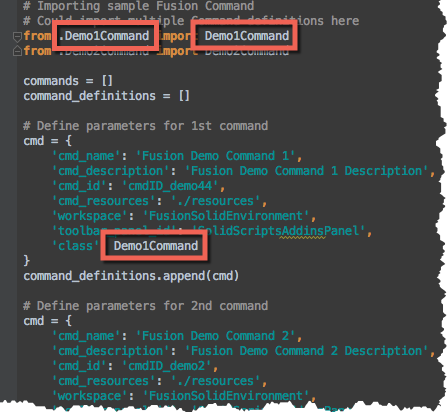

# Fusion360AddinSkeleton
Framework to simplify the creation of Fusion 360 Addin

The documentation still needs much work but here is a rough outline of to use the framework:

# Usage
Download or clone this repo.  

Move the folder into your add-ins directory.  [Click Here](https://tapnair.github.io/installation.html) for more information 

Files in the Fusion360Utilities folder should not be modified.

Rename the following items to your desired addin name: 
* The top level folder
* Fusion360AddinSkeleton.py 
* Fusion360AddinSkeleton.manifest

Edit the manifest file and update the fields accordingly

# Creating an addin:
## Step 1 
Open the newly renamed python file

The current file will create two commands in the Fusion 360 UI in the Addins Drop Down

Change the names and description strings here to your desired naming conventions

Currently each command relies on a separate file called Demo1Command.py and demo2Command.py

If you want to rename the files that define the names of the commands you must do it for each one in 3 places:




## Step 2

Edit Demo1Command.py and add functionality to the desired methods.  

onCreate: Build your UI components here

onExecute: Will be executed when user selects OK in command dialog.

DemoCommand1 creates a very basic UI and then accesses the input parameters.

## Some helpful extras:

### _input_values_

In the on_execute, on_preview, on_input_changed methods there is a parameter called "input_values"

This parameter is a dictionary containing the relevant values for all of the user inputs.

The key is the name of the input.

The value is dependant on the type input:
* Value type inputs will have their actual value stored (string or number depending)
* List type inputs (drop downs, etc) will have the name of the selected item as the value (string)
* Selection inputs regardless of whether they contain one or more selections will be returned as an array of the selected objects

_Note: you can still access the raw command inputs object with the "inputs" variable.  This would behave similar to any of the examples in the API documentation._


### _get_app_objects_

This is a helper function that returns a dictionary of many useful fusion 360 application objects.

This is the format of the returned dictionary:
```
app_objects = {
        'app': app,
        'design': design,
        'import_manager': import_manager,
        'ui': ui,
        'units_manager': units_manager,
        'all_occurrences': all_occurrences,
        'all_components': all_components,
        'root_comp': root_comp,
        'time_line': time_line,
        'export_manager': export_manager,
        'document': document
    }
```

## Samples

The following are references that implement this methodology:

[ParamEdit] (https://github.com/tapnair/ParamEdit) UI Form for Editing Fusion User Parameters in Fusion 360

[HelixGenerator] (https://github.com/tapnair/HelixGenerator) Fusion 360 addin to generate helical curves

[ventMaker] (https://github.com/tapnair/ventMaker) Fusion 360 Add-in to Create Vent Features

[SlicerImport] (https://github.com/tapnair/SlicerImport) Fusion Slicer to Fusion 360 import utility

[FusionStreetTeam] (https://github.com/tapnair/FusionStreetTeam) Fusion 360 add-in to quickly access Street team resources

## License
Samples are licensed under the terms of the [MIT License](http://opensource.org/licenses/MIT). Please see the [LICENSE](LICENSE) file for full details.

## Written by

Written by [Patrick Rainsberry](https://twitter.com/prrainsberry) <br /> (Autodesk Fusion 360 Business Development)

See more useful [Fusion 360 Utilities](https://tapnair.github.io/index.html)

[](https://github.com/igrigorik/ga-beacon)

