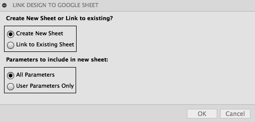
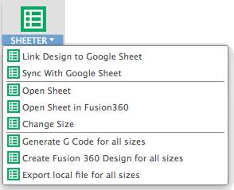

# FusionSheeter

Connect a Fusion 360 design to Google Sheets

NOTE: This sample is provided "As-is" with no guarantee of performance, reliability or warranty.

# Installation
[Click here to download the Add-in](https://github.com/tapnair/FusionSheeter/archive/master.zip)

After downloading the zip file follow the [installation instructions here](https://tapnair.github.io/installation.html) for your particular OS version of Fusion 360

# Usage

Documentation to come later. For now:

See a video here: https://youtu.be/dwWDpQSrz7o

There are 3 tabs (sheets) in the Sheets Document:
- Parameters
    - Header row defines parameter name in Fusion design
- BOM
    - If the design is an assembly you can edit Description and Number for all components
    - Note: It is based on name so you CANNOT rename components here
    - There is no concept of sizes or 'configurations' at the assembly level... yet
- Features
    - Allows you to control suppression state of features in a given 'size'
    - Note this is still a work in progress and may not always be reliable.
    - The biggest limitation is that if you add new features they cannot automatically be added to the sheet yet.
    - To add new features you need to add a column to the sheet that matches the feature name in the time line

### Link Design to a Google Sheet

- Link to an existing sheet or create a new one.
- Choose either User Parameters or All Parameters.
(All parameters is every dimension in the model)
- Link will persist with design document in Fusion 360

### Sync with Google Sheet
- Select to *Pull* data from the Sheet document or *Push* data
- Push Data:
    - Select parameters and or BOM data
    - Parameters you can update the current size or create a new size
    - BOM data will over-write existing sheet data with current model data

### Open Sheet
- Opens Sheet document in browser

### Open Sheet in Fusion 360
- Opens the sheet document in the Fusion 360 window
- It can be convenient at times to do this, but it is sometimes difficult to navigate the sheets interface in this small window.  I recomend using the external window.

### Change Size
- At any given time, the current design is 'associated' to a row in the sheet.
- To change the associated row use this command to select another size
- The values you see in the drop down are driven from the 'Description' field

### Generate G Code for all sizes
- Will generate output nc code for all sizes in the associated Google Sheet
- Manually type in the name of the post to use (sorry)
- Select an output folder
- Choose the setups, Folders, or operations to export

### Create Fusion 360 Design for all Sizes
- Creates a unique Fusion 360 design in your current project for each size
- Useful if you need to use the different sizes in individual drawings or assemblies

### Export local file for all sizes
- Export 1 or more neutral file format types to a local directory
- Each size in the sheet will be exported

# TODO / Enhancements:
- Push changes to time line to feature sheet
- Drop downs for post names in G Code

## License
Samples are licensed under the terms of the [MIT License](http://opensource.org/licenses/MIT). Please see the [LICENSE](LICENSE) file for full details.

## Written by

Written by [Patrick Rainsberry](https://twitter.com/prrainsberry)   (Autodesk Fusion 360 Business Development)

See more useful [Fusion 360 Utilities](https://tapnair.github.io/index.html)

